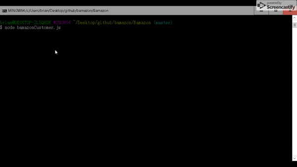

# Bamazon
Node.js &amp; MySQL 

The app will prompt users with two messages.

The first should ask them the ID of the product they would like to buy.
The second message should ask how many units of the product they would like to buy.

Once the customer has placed the order, the application should check if the store has enough of the product to meet the customer's request.

If not, the app should log a phrase like Insufficient quantity!, and then prevent the order from going through.

However, if the store does have enough of the product,fulfill the customer's order.

It will update the SQL database to reflect the remaining quantity.
Once the update goes through, show the customer the total cost of their purchase.

